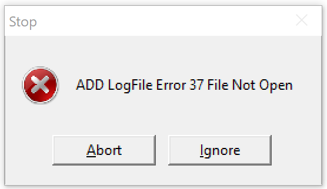
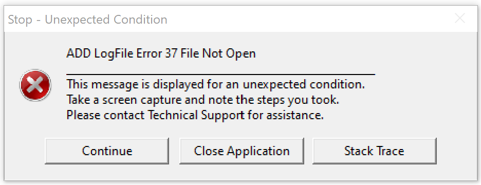
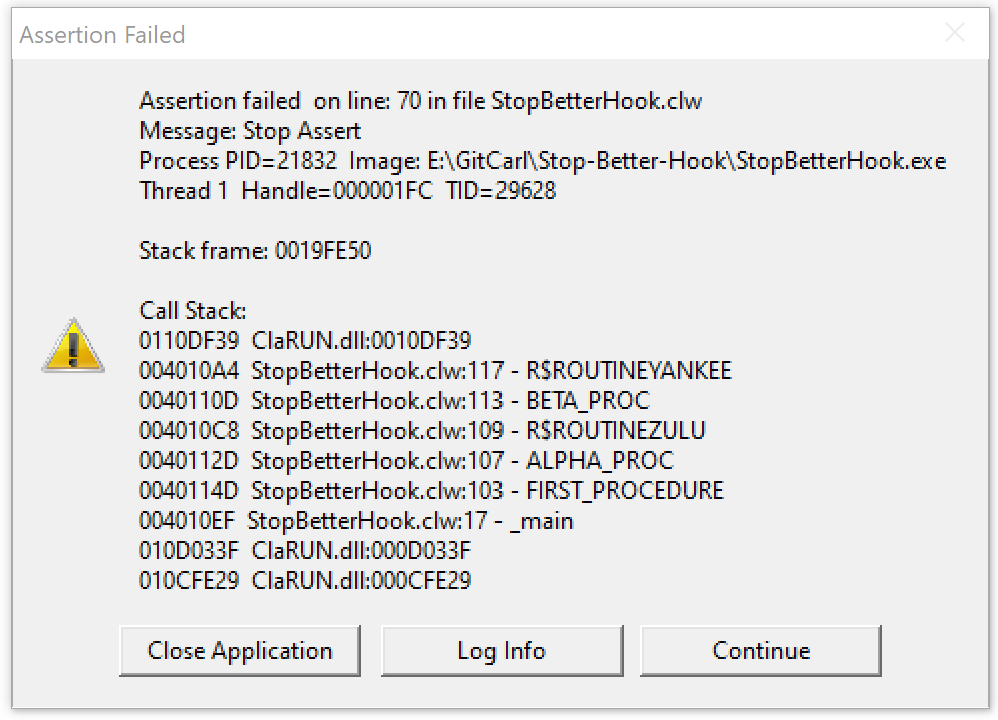

# Stop-Better-Hook
 STOP() Happens use Stop Hook to display a better dialog

STOP() should never be in production code, but sometimes shtop happens.
 The STOP() statement shows an ugly window that is confusing to users.
 There is no hint the ABORT button halts the program, and its the default!
 
 

Using `System{PROP:StopHook}` it is easy to replace the RTL Stop Dialog with one of your own.
 My dialog below renames the buttons to be more obvious, and the Continue button (aka IGNORE) is the default.
 Most STOP() left in code are terse so I add a footer to explain this is an "Unexpected Condition".

 

And the BEST part .... where is this STOP() in my code?

Debug Build's add a "Stack Track" button that calls ASSERT() which shows Stack Trace making it easy to find the code with this STOP.
 Be sure to use the Debug ClaRUN.dll to get [Procedure Names in the stack Trace.](https://clarionhub.com/t/how-to-improve-the-call-stack-when-your-program-gpfs-to-show-procedure-names/188)
 I included my RED files.

 

The code is simple. Below are some snippets.

```Clarion
StopBetter    PROCEDURE(<STRING Message>)   !Better 

  SYSTEM{PROP:StopHook} = ADDRESS(StopBetter)  !Tell RTL for STOP to call StopBetter()
  
!---------------------------------------------------------------------------
StopBetter  PROCEDURE(<STRING pMessage>)
BlankMsg    STRING('Exit Application?')  !for called as STOP()
StopMessage &STRING
FooterText  STRING('<13,10>_{60}' & |
            '<13,10>This message is displayed for an unexpected condition.' & |
            '<13,10>Take a screen capture and note the steps you took.' & |
            '<13,10>Please contact Technical Support for assistance.' )
AssertBtn   PSTRING(24)
    CODE
    IF ~OMITTED(pMessage) AND pMessage THEN
        StopMessage &= pMessage 
    ELSE
        StopMessage &= BlankMsg   !Called as STOP()
    END
    
!    COMPILE('** debug **',_Debug_) !w/o Debug *No Assert() or Stack Trace
    AssertBtn='|Stack Trace'        
            !** debug **            

    CASE MESSAGE(CLIP(StopMessage) & FooterText, | ! Message Text
                 'Stop - Unexpected Condition',  | ! Caption
                 ICON:Hand,                      | ! Icon 
                 'Continue|Close Application' & AssertBtn, | 
                   1)
    OF 2 ; HALT()         !Close Application
    OF 3 ; ASSERT(0,'Stop Assert')
    END
    RETURN  

``` 